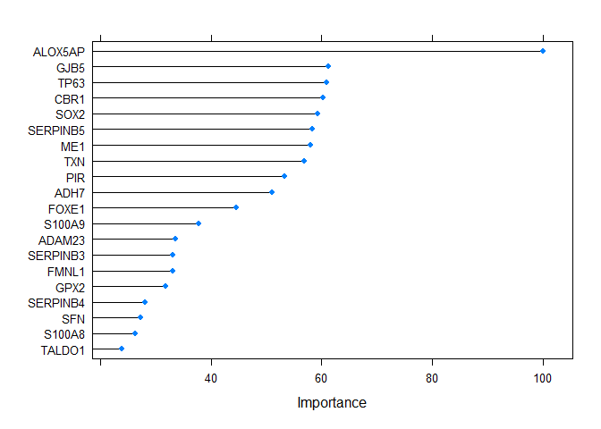
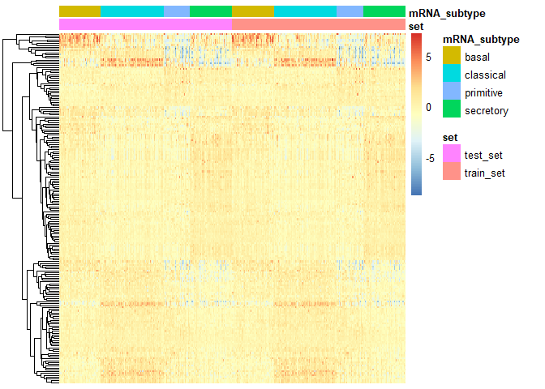

<!-- README.md is generated from README.Rmd. Please edit that file -->

# OncoSubtype

Provide functionality for cancer subtyping using existing published
methods or machine learning based on TCGA data.

Currently support mRNA subtyping:

-   LUSC using [nearest centroids
    method](https://aacrjournals.org/clincancerres/article/16/19/4864/75620/Lung-Squamous-Cell-Carcinoma-mRNA-Expression)
    or random forest method by training TCGA data.
-   LUAD using [nearest centroids
    method](https://journals.plos.org/plosone/article?id=10.1371/journal.pone.0036530)
    or random forest method by training TCGA data.
-   HNSC using [nearest centroids
    method](https://www.nature.com/articles/nature14129) or random
    forest method by training TCGA data.
-   BLCA using random forest (rf) method by training TCGA data.
-   ESCA using random forest (rf) method by training TCGA data.
-   ESCC using random forest (rf) method by training TCGA data.
-   BRCA using PAM50 method based on R package genefu.
-   STAD using random forest (rf) method by training TCGA data.

## Latest release

1.0.0 <!-- badges: start --> <!-- badges: end -->

## Installation

You can install the released version through:

``` r
install.packages("OncoSubtype")
```

## Example

This is a basic example for predicting the subtypes for Lung Squamous
Cell Carcinoma (LUSC).

### Predict LUSC mRNA Expression Subtypes using [nearest centroids method](https://aacrjournals.org/clincancerres/article/16/19/4864/75620/Lung-Squamous-Cell-Carcinoma-mRNA-Expression)

``` r
library(OncoSubtype)
library(tidyverse)
data <- get_median_centered(example_fpkm)
data <- assays(data)$centered
rownames(data) <- rowData(example_fpkm)$external_gene_name
# use default wilkerson's method
output1 <- centroids_subtype(data, disease = 'LUSC')
table(output1@subtypes)
#> 
#>     basal classical primitive secretory 
#>        44        65        26        44
```

### Using random forest model by training TCGA LUSC data

``` r
output2 <- ml_subtype(data, disease = 'LUSC', method = 'rf', seed = 123)
table(output2@subtypes)
#> 
#>     basal classical primitive secretory 
#>        43        65        27        44
```

### Check the consistance between two methods

``` r
confusionMatrix(as.factor(tolower(output1@subtypes)),
                as.factor(tolower(output2@subtypes)))
#> Confusion Matrix and Statistics
#> 
#>            Reference
#> Prediction  basal classical primitive secretory
#>   basal        43         1         0         0
#>   classical     0        64         1         0
#>   primitive     0         0        26         0
#>   secretory     0         0         0        44
#> 
#> Overall Statistics
#>                                           
#>                Accuracy : 0.9888          
#>                  95% CI : (0.9602, 0.9986)
#>     No Information Rate : 0.3631          
#>     P-Value [Acc > NIR] : < 2.2e-16       
#>                                           
#>                   Kappa : 0.9846          
#>                                           
#>  Mcnemar's Test P-Value : NA              
#> 
#> Statistics by Class:
#> 
#>                      Class: basal Class: classical Class: primitive
#> Sensitivity                1.0000           0.9846           0.9630
#> Specificity                0.9926           0.9912           1.0000
#> Pos Pred Value             0.9773           0.9846           1.0000
#> Neg Pred Value             1.0000           0.9912           0.9935
#> Prevalence                 0.2402           0.3631           0.1508
#> Detection Rate             0.2402           0.3575           0.1453
#> Detection Prevalence       0.2458           0.3631           0.1453
#> Balanced Accuracy          0.9963           0.9879           0.9815
#>                      Class: secretory
#> Sensitivity                    1.0000
#> Specificity                    1.0000
#> Pos Pred Value                 1.0000
#> Neg Pred Value                 1.0000
#> Prevalence                     0.2458
#> Detection Rate                 0.2458
#> Detection Prevalence           0.2458
#> Balanced Accuracy              1.0000
```

### Plot important genes

``` r
vi <- varImp(output2@method, scale = TRUE)
plot(vi, top = 20) 
```



### Plotheat map

``` r
PlotHeat(object = output2, set = 'both', fontsize = 10,
        show_rownames = FALSE, show_colnames = FALSE)
```



## Report bugs or issues at [here](https://github.com/DadongZ/OncoSubtype/issues)
